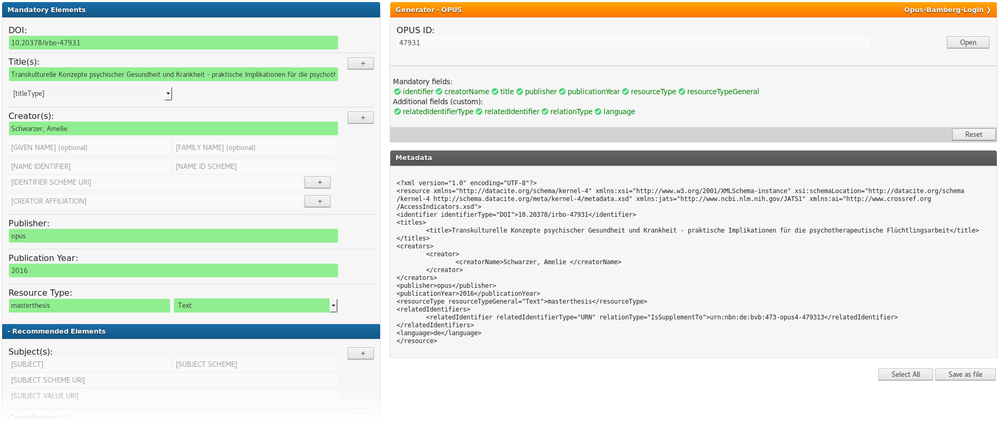

**Fork of [DataCite Metadata Generator - Kernel 4.0](https://github.com/mpaluch/datacite-metadata-generator)**

[


](https://hub.docker.com/r/unibaub/datacite-metadata-generator-for-opus)

# DataCite Metadata Generator for OPUS (DMGO)

This fork of [DataCite Metadata Generator](https://github.com/mpaluch/datacite-metadata-generator) enhances the basic functionality of creating DataCite Metadata Kernel 4.0 XML via forms by automatically fetching and parsing XML data of your [BIB-OPUS-Publikationsserver](https://opus4.kobv.de/opus4-bib-info/solrsearch/browse).



**NOTE: In the current state DMGO does only work with Bamberg's specific XSLT when exporting data from OPUS. For the future we plan to make DMGO more flexible to allow other facilities to use DMGO with their own OPUS publication server and their own requirements.**


# How To Use With Docker:

### Requirements
- [Docker](https://docs.docker.com/engine/installation/)
- [docker-compose](https://docs.docker.com/compose/install/)

**Requesites:** customize the configuration section in `src/be.js`

### On your local machine or on your server
```
docker-compose up
```

### On your local machine with mounted host directory for testing purposes
```
docker-compose -f docker-compose.dev.yml up
```
DMGO is now accessible under http://localhost/datacite_metadata_generator.html.


# How To Use Without Docker

### Requirements
- Web server with PHP

**Requesites:** customize the configuration section in `src/be.js`

Copy `datacite_metadata_generator.html` and the `src/` directory to your web server.

# Developement

**Branches:**
- Releases: *master*
- Developement: *develop*


**Create New Feature Branch**
```
git checkout -b <feature_name> develop
```

**Merge Feature into Developement Branch**
```
git checkout develop
git merge -e --no-ff <feature_name>
```

**Delete Feature Branch**
```
git branch -d <feature_name>
```

**Create New Release**
```
git checkout master
git merge -e --no-ff develop
git tag <version>
git push origin master
git push --tags
```

[Source](http://nvie.com/posts/a-successful-git-branching-model/)
